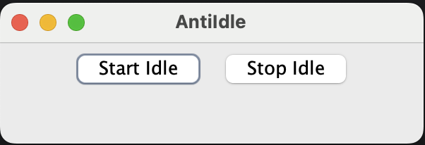

# AntiIdle

[](https://www.oracle.com/java/)
[](LICENSE.md)
[](https://gradle.org/)

The **AntiIdle** project is a lightweight Java application that simulates user activity to prevent system idle sleep. It features a simple graphical user interface (GUI) with intuitive controls for managing the idle prevention service.



## 🚀 Features

- **Smart Mouse Movement**: Intelligently moves the mouse cursor slightly from its current position to prevent system idle sleep
- **Keyboard Simulation**: Simulates harmless key presses (Shift key) to maintain system activity  
- **User-Friendly GUI**: Clean and simple interface with Start/Stop controls
- **Optimized Intervals**: 30-second activity intervals for efficient idle prevention
- **Cross-Platform**: Works on Windows, macOS, and Linux systems with Java support
- **Lightweight**: Minimal resource usage and system impact

## 📋 Requirements

- **Java Development Kit (JDK) 21 or higher**
- System with AWT and Swing support
- Screen access permissions (may be required on macOS/Linux)

## 🛠️ Installation & Usage

### Method 1: Using Pre-built JAR

1. **Clone the repository:**
   ```bash
   git clone https://github.com/uppnrise/antiidle.git
   cd antiidle
   ```

2. **Build the project:**
   ```bash
   ./gradlew build
   ```

3. **Run the application:**
   ```bash
   java -jar build/libs/antiidle-1.1.0.jar
   ```

### Method 2: Using Application Scripts

1. Build the project as above
2. Run using the generated scripts:
   ```bash
   # On macOS/Linux:
   ./build/scripts/antiidle
   
   # On Windows:
   build\scripts\antiidle.bat
   ```

### Using the Application

1. **Start the application** - The GUI window will appear
2. **Click "Start Idle"** - Begins the idle prevention simulation
3. **Click "Stop Idle"** - Stops the simulation
4. **Close the window** - Exits the application

## 🔧 Technical Details

### Algorithm Overview

1. **Initialization**: Creates a `Robot` instance for system input simulation
2. **Activity Simulation**: 
   - Detects current mouse position
   - Moves mouse 1 pixel and back to simulate natural movement
   - Presses and releases Shift key briefly
   - Waits 30 seconds before repeating
3. **Thread Management**: Uses separate thread for background operation
4. **Graceful Shutdown**: Properly handles thread interruption and cleanup

### Architecture

- **Main Class**: `AntiIdleGUI` - Handles GUI and core functionality
- **Threading**: Background thread for non-blocking idle simulation
- **Input Simulation**: Java AWT Robot for cross-platform input events

## 🧪 Testing

Run the test suite:
```bash
./gradlew test
```

The project includes unit tests for:
- Thread lifecycle management
- GUI button interactions
- Start/stop functionality

## 🔒 Permissions

### macOS
You may need to grant accessibility permissions:
1. Go to **System Preferences** → **Security & Privacy** → **Privacy**
2. Select **Accessibility** from the left panel
3. Add your terminal application or Java to the allowed applications

### Linux
Ensure your user has access to input devices (usually automatic).

## 🤝 Contributing

Contributions are welcome! Please feel free to submit a Pull Request. For major changes:

1. Fork the repository
2. Create a feature branch (`git checkout -b feature/AmazingFeature`)
3. Commit your changes (`git commit -m 'Add some AmazingFeature'`)
4. Push to the branch (`git push origin feature/AmazingFeature`)
5. Open a Pull Request

### Development Setup

1. Clone the repository
2. Import into your favorite IDE (IntelliJ IDEA, Eclipse, VS Code)
3. Ensure Java 21+ is configured
4. Run `./gradlew build` to build and test

## 🐛 Troubleshooting

### Common Issues

**Application won't start on macOS:**
- Grant accessibility permissions as described above
- Ensure Java 21+ is installed: `java -version`

**Mouse movements not working:**
- Check if screen recording permissions are granted
- Verify the application has input access rights

**Build failures:**
- Ensure Gradle is installed or use the included wrapper: `./gradlew --version`
- Check Java version compatibility: `java -version`

### Reporting Issues

Please report bugs by [opening an issue](https://github.com/uppnrise/antiidle/issues) with:
- Operating system and version
- Java version (`java -version`)
- Steps to reproduce the issue
- Error messages (if any)

## 📝 License

This project is licensed under the MIT License - see the [LICENSE.md](LICENSE.md) file for details.

## ⚠️ Disclaimer

This application is intended for legitimate use cases such as:
- Preventing screensavers during presentations
- Keeping systems active during long-running tasks
- Maintaining remote desktop connections

Please use responsibly and in accordance with your organization's policies.