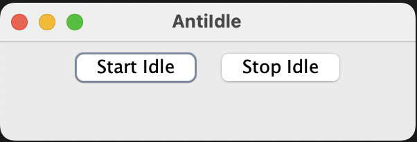

# AntiIdle

[](https://www.oracle.com/java/)
[](LICENSE.md)
[](https://gradle.org/)
[](https://github.com/uppnrise/antiidle/releases)

The **AntiIdle** project is a modern, lightweight Java application that simulates user activity to prevent system idle sleep. It features an elegant graphical user interface (GUI) with modern FlatLaf theming, comprehensive internationalization support (English & German), and intuitive controls for managing the idle prevention service.



## 🚀 Features

### Core Functionality
- **Smart Mouse Movement**: Intelligently moves the mouse cursor slightly from its current position to prevent system idle sleep
- **Keyboard Simulation**: Simulates harmless key presses (Shift key) to maintain system activity  
- **Configurable Intervals**: Customizable activity intervals for efficient idle prevention (default: 30 seconds)

### Modern UI/UX
- **FlatLaf Modern Look & Feel**: Beautiful, modern interface with support for Light, Dark, and System themes
- **Internationalization (i18n)**: Full support for English and German languages with easy switching
- **Comprehensive Settings Dialog**: Tabbed interface for configuring all aspects of the application
- **Intuitive Controls**: Clean interface with Start/Stop controls and visual status indicators
- **Menu-Driven Navigation**: Organized menus for File, Language, and Help functions
- **Tooltips**: Helpful tooltips on all interactive elements

### Technical Excellence
- **Cross-Platform**: Works on Windows, macOS, and Linux systems with Java support
- **Lightweight**: Minimal resource usage and system impact
- **Persistent Configuration**: Saves your preferences and window position automatically
- **Modern Architecture**: Built with latest Java 21, Jackson 2.18, SLF4J 2.0, and Logback 1.5
- **Code Quality**: Passes Checkstyle, SpotBugs, and JaCoCo quality checks

## 📋 Requirements

- **Java Development Kit (JDK) 21 or higher**
- System with AWT and Swing support
- Screen access permissions (may be required on macOS/Linux)

## 🛠️ Installation & Usage

### Method 1: Using Pre-built JAR

1. **Clone the repository:**
   ```bash
   git clone https://github.com/uppnrise/antiidle.git
   cd antiidle
   ```

2. **Build the project:**
   ```bash
   ./gradlew build
   ```

3. **Run the application:**
   ```bash
   java -jar build/libs/antiidle-2.0.0-all.jar
   ```
   
   **Note**: Use the `-all.jar` file which includes all dependencies. The regular `antiidle-2.0.0.jar` file does not include dependencies and will fail with `NoClassDefFoundError`.

### Method 2: Using Application Scripts

1. Build the project as above
2. Run using the generated scripts:
   ```bash
   # On macOS/Linux:
   ./build/scripts/antiidle
   
   # On Windows:
   build\scripts\antiidle.bat
   ```

### Using the Application

#### Basic Operation
1. **Start the application** - The modern GUI window will appear with FlatLaf theming
2. **Click "▶ Start"** - Begins the idle prevention simulation
3. **Click "⏹ Stop"** - Stops the simulation
4. **Close the window** - Exits the application (saves configuration automatically)

#### Settings Dialog
Access via **⚙ Settings** button or **File → Settings** menu:

**Activity Settings Tab**:
- Configure simulation interval (5-300 seconds)
- Enable/disable mouse movement simulation
- Adjust mouse movement distance
- Enable/disable keyboard simulation
- Customize simulation key and duration

**GUI Settings Tab**:
- **Language**: Choose between English and German
- **Theme**: Select System Default, Light Mode, or Dark Mode
- Configure system tray and notifications
- Dark mode toggle (legacy option)

**System Settings Tab**:
- Auto-start configuration
- System boot integration
- Update checking preferences

#### Language Switching
Switch languages anytime via **Language** menu:
- 🇬🇧 **English** - Full English interface
- 🇩🇪 **Deutsch** - Complete German translation

The application will prompt you to restart for language changes to take full effect.

#### Theme Customization
Choose your preferred theme:
- **System Default**: Automatically matches your operating system theme
- **Light Mode**: Clean, bright interface using FlatLaf IntelliJ theme
- **Dark Mode**: Easy on the eyes using FlatLaf Darcula theme

## ⚙️ Configuration

The application stores its configuration in `~/.antiidle/antiidle-config.yml`. This file is automatically created on first run and updated when you save settings.

### Configuration Options

```yaml
activity:
  interval_seconds: 30              # Time between activity simulations
  mouse_movement_enabled: true       # Enable mouse simulation
  mouse_movement_distance: 1         # Pixels to move mouse
  keyboard_simulation_enabled: true  # Enable keyboard simulation
  simulation_key: "SHIFT"           # Key to simulate
  key_press_duration_ms: 100        # How long to press key

gui:
  language: "en"                    # Interface language (en/de)
  theme: "system"                   # UI theme (system/light/dark)
  dark_mode: false                  # Legacy dark mode setting
  minimize_to_tray: true            # Minimize to system tray
  show_notifications: true          # Show system notifications
  window_position_x: -1             # Saved window X position
  window_position_y: -1             # Saved window Y position

system:
  auto_start: false                 # Auto-start simulation on launch
  start_on_boot: false              # Start with operating system
  check_for_updates: true           # Check for application updates

logging:
  log_level: "INFO"                 # Logging level
  log_to_file: true                 # Enable file logging
  max_log_file_size_mb: 10         # Maximum log file size
  keep_log_files: 5                # Number of log files to keep
```

## 🔧 Technical Details

### Algorithm Overview

1. **Initialization**: Creates a `Robot` instance for system input simulation
2. **Activity Simulation**: 
   - Detects current mouse position
   - Moves mouse 1 pixel and back to simulate natural movement
   - Presses and releases Shift key briefly
   - Waits 30 seconds before repeating
3. **Thread Management**: Uses separate thread for background operation
4. **Graceful Shutdown**: Properly handles thread interruption and cleanup

### Architecture

The application follows a clean, modular architecture:

- **`AntiIdleGUI`**: Main GUI class with FlatLaf theming and menu system
- **`ActivitySimulator`**: Core simulation engine managing mouse and keyboard events
- **`ConfigurationManager`**: Handles loading, saving, and managing application configuration
- **`I18nManager`**: Internationalization manager for multi-language support
- **`SettingsDialog`**: Comprehensive settings UI with tabbed interface

**Key Technologies**:
- **FlatLaf 3.5.4**: Modern Look and Feel for Swing applications
- **Jackson 2.18.2**: YAML configuration parsing and serialization
- **SLF4J 2.0.16 + Logback 1.5.15**: Professional logging framework
- **Java ResourceBundle**: Standard i18n support for translations
- **Java AWT Robot**: Cross-platform input event simulation

**Design Patterns**:
- Singleton pattern for I18nManager
- MVC-like separation with GUI, core logic, and configuration
- Observer pattern for configuration changes
- Builder pattern in Gradle build configuration

## 🧪 Testing

Run the test suite:
```bash
./gradlew test
```

The project includes unit tests for:
- Thread lifecycle management
- GUI button interactions
- Start/stop functionality
- Configuration persistence and loading
- ActivitySimulator behavior

Run with coverage report:
```bash
./gradlew test jacocoTestReport
```

Quality checks (Checkstyle, SpotBugs):
```bash
./gradlew check
```

## 🌐 Internationalization (i18n)

AntiIdle v2.0 introduces comprehensive internationalization support with the following languages:

### Supported Languages

- **English (en)** - Default language
- **German (de)** - Vollständige deutsche Übersetzung

### Adding New Translations

To add support for a new language:

1. Create a new properties file: `src/main/resources/i18n/messages_{language_code}.properties`
2. Copy all keys from `messages_en.properties`
3. Translate the values to your target language
4. Update `I18nManager.getAvailableLocales()` to include the new locale
5. Add menu items in `AntiIdleGUI.setupMenuBar()`

Example:
```properties
# messages_fr.properties
app.title=AntiIdle v2.0.0
button.start=▶ Démarrer
button.stop=⏹ Arrêter
status.running=▶ Prévention d'inactivité en cours
```

### Translation Keys

All UI text is externalized to properties files with organized key prefixes:
- `app.*` - Application-level strings
- `button.*` - Button labels
- `menu.*` - Menu items
- `status.*` - Status messages
- `activity.*` - Activity-related settings
- `gui.*` - GUI settings
- `system.*` - System settings
- `language.*` - Language names
- `dialog.*` - Dialog messages and titles
- `tooltip.*` - Tooltip text

## 🔒 Permissions

### macOS
You may need to grant accessibility permissions:
1. Go to **System Preferences** → **Security & Privacy** → **Privacy**
2. Select **Accessibility** from the left panel
3. Add your terminal application or Java to the allowed applications

### Linux
Ensure your user has access to input devices (usually automatic).

## 🤝 Contributing

Contributions are welcome! Please feel free to submit a Pull Request. For major changes:

1. Fork the repository
2. Create a feature branch (`git checkout -b feature/AmazingFeature`)
3. Commit your changes (`git commit -m 'Add some AmazingFeature'`)
4. Push to the branch (`git push origin feature/AmazingFeature`)
5. Open a Pull Request

### Development Setup

1. Clone the repository
2. Import into your favorite IDE (IntelliJ IDEA, Eclipse, VS Code)
3. Ensure Java 21+ is configured
4. Run `./gradlew build` to build and test

## 🐛 Troubleshooting

### Common Issues

**Application won't start on macOS:**
- Grant accessibility permissions as described above
- Ensure Java 21+ is installed: `java -version`

**Theme not applying correctly:**
- Restart the application after changing theme settings
- Check that FlatLaf libraries are included in the JAR

**Language not changing:**
- Restart the application after changing language settings
- Verify the language properties files exist in resources

**NoClassDefFoundError when running JAR:**
- Use the fat JAR with all dependencies: `java -jar build/libs/antiidle-2.0.0-all.jar`
- The regular `antiidle-2.0.0.jar` file does not include dependencies
- Ensure you have Java 21 or higher installed: `java -version`

**Mouse movements not working:**
- Check if screen recording permissions are granted
- Verify the application has input access rights

**Build failures:**
- Ensure Gradle is installed or use the included wrapper: `./gradlew --version`
- Check Java version compatibility: `java -version`
- Clean and rebuild: `./gradlew clean build`

### Reporting Issues

Please report bugs by [opening an issue](https://github.com/uppnrise/antiidle/issues) with:
- Operating system and version
- Java version (`java -version`)
- Steps to reproduce the issue
- Error messages (if any)

## 📝 License

This project is licensed under the MIT License - see the [LICENSE.md](LICENSE.md) file for details.

## ⚠️ Disclaimer

This application is intended for legitimate use cases such as:
- Preventing screensavers during presentations
- Keeping systems active during long-running tasks
- Maintaining remote desktop connections

Please use responsibly and in accordance with your organization's policies.

## 📦 What's New in v2.0.0

### Major Features
- 🎨 **Modern FlatLaf UI**: Beautiful, professional interface with Light/Dark/System themes
- 🌐 **Internationalization**: Full English and German language support
- ⚙️ **Comprehensive Settings**: New tabbed settings dialog for complete customization
- 📋 **Menu System**: Organized File, Language, and Help menus
- 💾 **Persistent Configuration**: Automatic saving of all settings and preferences

### Technical Improvements
- ⬆️ **Updated Dependencies**: All libraries updated to latest stable versions
- 🔒 **Security**: No vulnerabilities (verified via GitHub Advisory Database)
- ✅ **Code Quality**: Passes all Checkstyle, SpotBugs, and test checks
- 📚 **Better Documentation**: Comprehensive README with examples and troubleshooting

### Breaking Changes
- Version bumped from 1.1.0 to 2.0.0
- Configuration file format remains compatible
- New theme and language settings in config

For complete changelog, see [CHANGELOG.md](CHANGELOG.md)